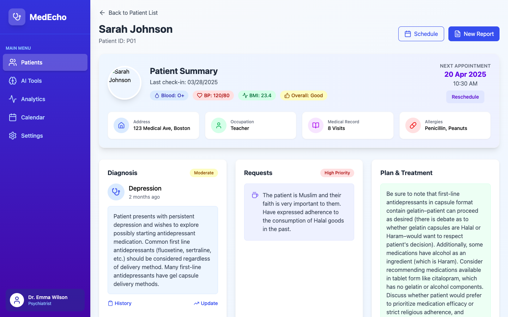

---

# AI and Medical Empathy for Ethical Shared Decision-Making Project
**Capstone Project – Master of Bioethics, Harvard Medical School**

**Mentee:** Sydney Collins  
**Mentor:** Litong Jiang

---

## Overview

The AI and Medical Empathy for Ethical Shared Decision-Making Project is the capstone research project of the Master of Bioethics Program at Harvard Medical School. Rooted in the core principles of bioethics, this initiative investigates how artificial intelligence (AI) can be ethically leveraged to enhance clinical decision-making by integrating patient values, life goals, and cultural identities into personalized care pathways.

This project aims to bridge the divide between cutting-edge AI technologies and the ethical imperatives of human-centered medicine. By promoting shared decision-making that honors autonomy, dignity, informed consent, and contextual sensitivity, we seek to advance a model of care where technological innovation supports, rather than replaces, the moral agency of patients and clinicians.

---

##Project Objectives

AI as a Bioethics Research Tool: Utilize large language models (LLMs) to investigate and model ethical reasoning in clinical settings, positioning AI not only as a subject of ethical scrutiny, but also as a methodological instrument for advancing bioethics research itself.

Value-Sensitive Clinical Modeling: Explore how LLMs can simulate ethically complex patient-clinician interactions, helping scholars and clinicians analyze how career aspirations, religious beliefs, cultural identities, and life goals influence ethical medical decision-making.

Empirical Bioethical Inquiry: Use AI tools to systematically study key principles of bioethics in practice:

Autonomy: How do patients understand and articulate their choices with LLM assistance?

Beneficence & Nonmaleficence: Can LLMs help identify ethical dilemmas where treatments may have conflicting outcomes?

Justice: Investigate how LLMs might reveal or reproduce disparities in care access, and how they might be redesigned for equity.

Prototype as Research Instrument: Build a proof-of-concept LLM-based tool that serves as a research platform—not merely a product—enabling empirical and conceptual exploration of ethical challenges in modern medical decision-making.

---

##Key Features

Bioethics-Driven Use of AI: Leverage large language models (LLMs) as instruments to explore and test bioethical concepts—focusing on how AI can model ethical reasoning, illuminate value conflicts, and simulate diverse clinical narratives for research purposes.

Contextualized Ethical Simulation: Construct ethically complex patient scenarios—incorporating variables such as cultural background, personal values, and social determinants of health—to support empirical bioethics inquiry in simulated clinical settings.

Theoretical Integration: Operationalize frameworks from principlism, care ethics, and narrative bioethics within LLM-driven simulations to examine how these theories perform in practice and guide decision-making.

Synthetic Case Methodology: Develop and analyze privacy-preserving synthetic patient profiles to ethically study edge cases, trade-offs, and biases in medical decision-making—without exposing real patient data.

Ethics Research, Not Just Tool Design: Rather than building AI for deployment, the project prioritizes the use of AI as a reflective space for ethical analysis, offering a novel methodology for contemporary bioethics research.
---

## Bioethics Foundations

This project is grounded in **core bioethical principles** and **theoretical frameworks**, will include:

- **Principlism** (Beauchamp and Childress): Autonomy, Beneficence, Nonmaleficence, Justice.
- **Narrative Ethics**: Understanding patients' stories to shape ethical clinical choices.
- **Relational Autonomy**: Recognizing that decisions are made within social and cultural contexts.
- **Care Ethics**: Emphasizing empathy, responsiveness, and attentiveness in medical AI.
- **Justice in Health AI**: Addressing concerns of bias, fairness, and equitable access in algorithmic systems.

We also explore contemporary ethical issues in the future, such as:
- **Algorithmic Transparency** and **Explainability**.
- **Data Privacy** and **Informed Consent** in AI applications.
- **Responsibility Attribution** in AI-driven decisions.

---

## Academic Context

This capstone reflects the **interdisciplinary nature** of modern bioethics, integrating insights from:

- **Medical Ethics and Humanities**
- **Artificial Intelligence & Data Science**
- **Clinical Medicine & Patient Care**
- **Health Policy, Law, and Technology Regulation**

It is conducted under the mentorship of faculty at **Harvard Medical School**, contributing to ongoing discussions on the **ethical deployment of AI in healthcare**.

---

## Collaboration

We welcome **academic engagement** and ethical discourse with:

- **Bioethics scholars** investigating AI, technology, and healthcare.
- **Clinicians** exploring patient-centered, ethically grounded AI tools.
- **AI researchers** committed to humanistic and responsible innovation.
- **Students** examining **shared decision-making** and value-based care models.

---
